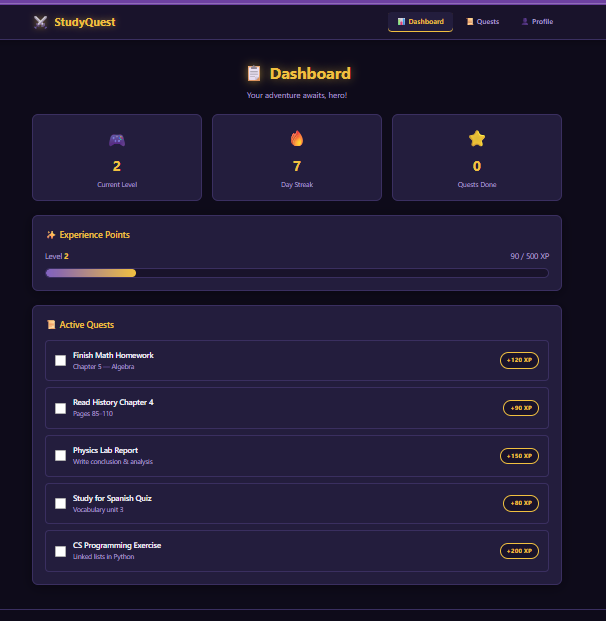
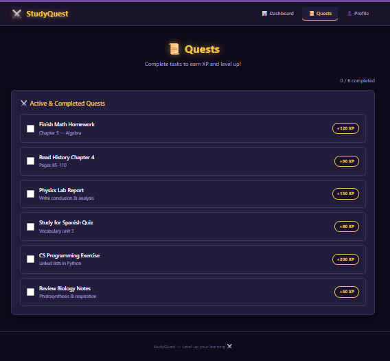
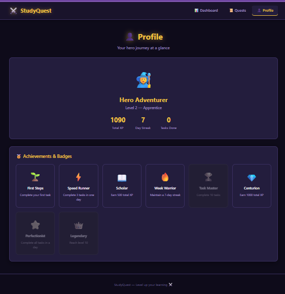

# StudyQuest – Part A (GUI Prototype)

---

## 1. Project Overview

StudyQuest is a gamified student productivity web interface designed to help users manage tasks and visualize progress through an RPG-style reward system.

This phase focuses on building a fully functional frontend prototype using AI-assisted coding tools.

---

## 3. Tools Used

- GitHub Copilot (AI-assisted coding)
- DeepSeek (API key inside the GitHub Copilot)

---

## 4. Project Structure

The application consists of three main pages:

### Dashboard (index.html)
- XP progress bar with animated fill
- current level display based on XP system
- daily streak counter
- active tasks overview
- navigation bar with active page highlighting

---

### Tasks Page (tasks.html)
- list of 6 mock quests
- each task has an XP reward
- checkbox interaction to mark completion
- XP and level update dynamically

---

### Profile Page (profile.html)
- total XP display
- calculated user level
- streak counter
- 8 achievement badges system

---

## 5. Interactive Features

This prototype includes frontend logic beyond static UI design:

- Task completion updates XP dynamically
- Level system (500 XP per level)
- Achievements unlock based on progress

---

## 6. Design Choices

- Dark RPG-inspired theme (purple, black, gold)
- Card-based layout for clarity
- Hover effects (lift, glow, shimmer)
- Animated XP bar for feedback
- Gamification elements to increase engagement

---

## 7. Data Handling

All data is simulated using JavaScript:

- Tasks stored in arrays
- XP calculated in frontend logic
- Achievements unlocked dynamically
- State persisted in browser using localStorage

No backend or database is used.

---

## 8. Limitations

- No authentication system
- No backend or API integration
- Data stored only in browser (localStorage)
- Not multi-user capable

---

## 9. Summary

This part of the task demonstrates AI-assisted frontend development using GitHub Copilot and DeepSeek.

## 10. Prompt Used

Here is the prompt that i used:

>Create a simple frontend-only UI for a project called "StudyQuest".
>
>The goal is to design a gamified student productivity dashboard using only:
>- HTML
>- CSS
>- vanilla JavaScript
>
>Do NOT use any frameworks (no React, no Vue, no Tailwind).
>
>The project should have 3 pages:
>
>1. Dashboard (index.html):
>- XP progress bar
>- current level display
>- daily streak counter
>- list of active tasks (mock data only)
>
>2. Tasks page (tasks.html):
>- list of tasks (quests)
>- each task has a title and XP reward
>- checkbox to mark completion (frontend only, no backend)
>
>3. Profile page (profile.html):
>- total XP
>- user level
>- simple achievements/badges section
>
>Design requirements:
>- dark theme
>- clean modern UI
>- gamified RPG-style aesthetic
>- card-based layout
>- simple hover effects
>
>Technical requirements:
>- use separate CSS file (style.css)
>- use minimal JavaScript for UI interactions only
>- use mock data inside JavaScript arrays
>- no backend or database
>
>Make it structured and easy to understand, as this is an AI-assisted coding assignment. 
>
>THIS HAS TO BE DONE IN THIS FOLDER: software_engineering_course -> B -> Task_13 -> A -> code