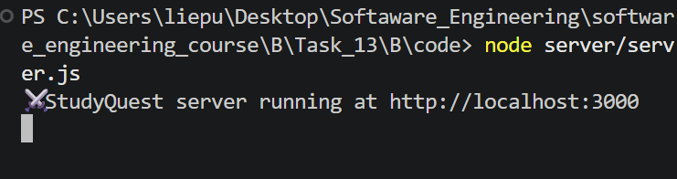

# StudyQuest – Part B (Full-Stack Application)

---

## 1. Overview

In Part B, the StudyQuest frontend from Part A was extended into a full-stack application by introducing a Node.js + Express backend.

---

## 2. Reuse from Part A

The following components were reused without changes to the UI:

- index.html (Dashboard UI)
- tasks.html (Tasks UI)
- profile.html (Profile UI)
- style.css (RPG-themed design system)

Only the JavaScript logic (app.js) was modified to integrate backend API communication.

---

## 3. Backend Implementation

A Node.js + Express backend was created to handle application logic and persistent storage.

### Backend Structure:

- server.js → Express REST API
- data.json → persistent storage file (acts as a lightweight database)
- package.json → Node project configuration

---

## 4. API Endpoints

The backend provides the following REST API endpoints:

### Task Management
- GET /tasks → fetch all tasks
- POST /tasks → create a new task
- PUT /tasks/:id → update task completion state
- DELETE /tasks/:id → delete task

### User Management
- GET /user → retrieve user data (XP, streak, level)
- POST /user/xp → increment user XP
- POST /user/streak → increment user streak

---

## 5. Frontend Changes (app.js)

The frontend logic was refactored from localStorage-based storage to API-based communication.

Key changes include:

- All data is now loaded via fetch() requests
- Task completion triggers backend updates
- XP is updated via API calls
- Streak is incremented via API calls
- UI state is dynamically refreshed from backend data

The visual design and layout remain unchanged from Part A.

---

## 6. Data Persistence

Instead of browser-based storage, all application data is stored in a JSON file (data.json).

This enables:
- persistent task completion state
- persistent XP progression
- persistent streak tracking

The backend is responsible for reading and updating this file.

---

## 7. AI Assistance

GitHub Copilot and DeepSeek were used to:
- refactor frontend logic into API-based architecture
- generate Express backend structure
- design REST API endpoints
- convert localStorage logic into server-side persistence
- debug frontend-backend communication

---

## 8. System Behavior

When a user completes a task:

1. Task state is updated via API
2. XP is incremented via backend
3. Streak is incremented via backend
4. Updated data is returned and rendered in UI
5. Data persists after page refresh

---

## 9. Limitations

- No authentication system
- Single-user system only
- No real database (uses JSON file storage)
- Not deployed to cloud environment

---

## 10. Summary

Part B successfully transforms StudyQuest into a full-stack application with backend integration and persistent data handling.

It demonstrates:
- REST API development
- frontend-backend communication
- state persistence
- AI-assisted refactoring using Copilot and DeepSeek

---

## 11. Screenshot

### Backend Running

## 12. Prompt Used

Here is the prompt that i used:

>Upgrade an existing frontend-only StudyQuest app into a full-stack application.
>
>Frontend:
>- HTML/CSS/vanilla JS already exists
>- Replace localStorage usage with API calls
>- Fetch tasks, XP, and user data from backend
>
>Backend:
>- Create Node.js + Express server
>- Implement REST API for tasks and user progress
>- Store data in a JSON file (no database required)
>
>API endpoints:
>- GET /tasks
>- POST /tasks
>- PUT /tasks/:id
>- DELETE /tasks/:id
>- GET /user
>- POST /user/xp
>- POST /user/streak
>
>Requirements:
>- Keep frontend UI unchanged
>- Only replace data handling logic
>- Ensure separation between frontend and backend
>- Keep code simple and well commented for learning purposes 
>
>THIS HAS TO BE DONE IN THIS FOLDER: software_engineering_course -> B -> Task_13 -> B -> code