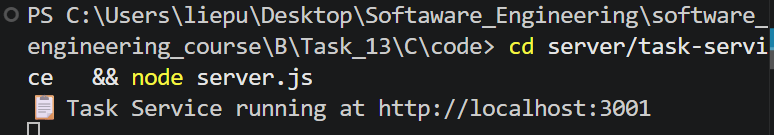
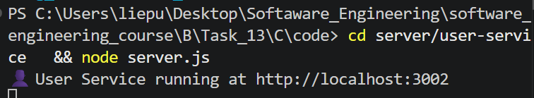
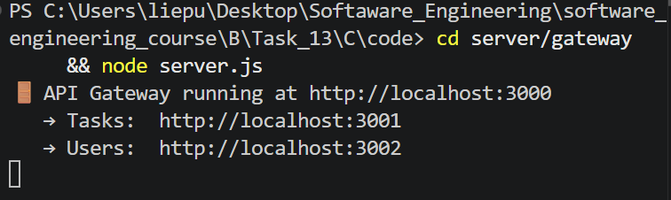
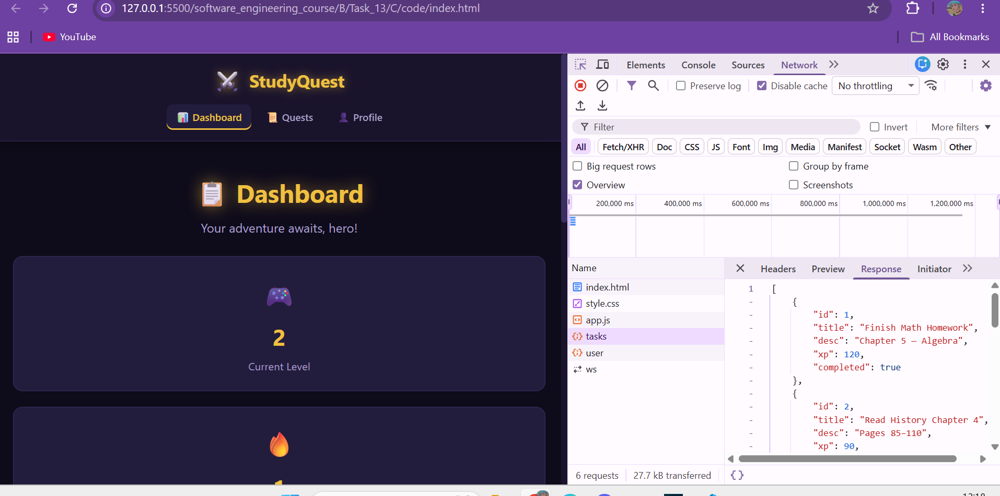
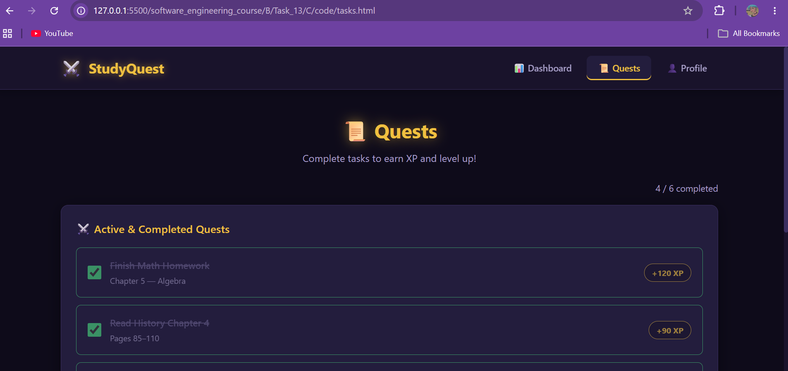

# StudyQuest – Part C (Distributed System)

---

## 1. Overview

In Part C, the StudyQuest application was refactored from a monolithic full-stack system into a distributed system using a microservice-style architecture.

---

## 2. System Architecture

The final system architecture is:
 Frontend (HTML / CSS / JavaScript)
        │
        ▼
API Gateway (Port 3000)
        │
        ├───────────────┬────────────────
        ▼               ▼
Task Service        User Service
(Port 3001)         (Port 3002)

The frontend communicates only with the API Gateway, which routes requests to the appropriate backend service.

---

## 3. Services Overview

### API Gateway (Port 3000)

The API Gateway acts as the single entry point for the frontend.

Responsibilities:
- Receives all frontend requests
- Routes task-related requests to the Task Service
- Routes user-related requests to the User Service
- Hides internal service structure from the frontend

This ensures a clean separation between frontend and backend services.

---

### Task Service (Port 3001)

The Task Service handles all task-related functionality.

Features:
- Create tasks
- Read tasks
- Update task completion state
- Delete tasks

Task data is stored independently in its own `data.json` file.

---

### User Service (Port 3002)

The User Service manages user-related state.

Features:
- XP tracking
- Streak tracking
- User progress retrieval

User data is stored separately in its own `data.json` file.

---

## 4. Frontend Behavior

The frontend remains visually unchanged from Part B.

However, all API calls are now routed through the API Gateway:
http://localhost:3000

The frontend does not communicate directly with any backend service.

All requests are handled through the gateway layer.

---

## 5. Data Management

Data is now distributed across services:

- Task Service → manages task data
- User Service → manages user progress data

Each service maintains its own isolated JSON storage file.

This improves modularity and reflects distributed system design principles.

---

## 6. System Behavior Flow

When a user interacts with the system:

1. User clicks a task checkbox in the frontend
2. Request is sent to API Gateway (port 3000)
3. API Gateway routes request to Task Service (port 3001)
4. Task Service updates task state
5. API Gateway forwards user updates to User Service (port 3002)
6. XP and streak are updated accordingly
7. Updated data is returned and rendered in the UI

---

## 7. How to Run the System

Start each service in separate terminals:

Task Service:
node server/task-service/server.js

User Service:
node server/user-service/server.js

API Gateway:
node server/gateway/server.js

Then open:
- index.html
- tasks.html
- profile.html

The frontend communicates only with the API Gateway.

---

## 8. AI Assistance

GitHub Copilot and DeepSeek were used to:

- Refactor a monolithic backend into distributed services
- Design API Gateway routing logic
- Separate business logic into independent services
- Maintain frontend compatibility without UI changes

---

## 9. Limitations

- No authentication system
- No containerization (e.g., Docker)
- No service discovery mechanism
- Services run locally on separate ports manually
- Simplified distributed architecture for educational purposes

---

## 10. Screenshots

### Services Running
Proof that all backend services are active.

### Devtools 
Frontend communicates only with port 3000.

### Data Persistence

Proof that data is persisted across services.

---

## 11. Summary

Part C successfully transforms StudyQuest into a distributed system using an API Gateway and two independent backend services.

This demonstrates:
- Microservice-style architecture
- Separation of concerns
- API Gateway routing pattern
- Distributed system communication
- Persistent data handling across services

## 12. Prompt used

Here is the promp i used:

>Refactor this existing StudyQuest full-stack application into a distributed system.
>
>DO NOT change the frontend UI or redesign the app.
>
>Current system:
>- Frontend (HTML/CSS/JS)
>- Node.js Express backend (single server with all logic)
>- JSON file storage (data.json)
>
>Required transformation:
>
>Split the backend into 3 separate services:
>
>1. Task Service (port 3001)
>- Handles all task CRUD operations
>- GET /tasks
>- POST /tasks
>- PUT /tasks/:id
>- DELETE /tasks/:id
>
>2. User Service (port 3002)
>- Handles user data (XP, streak)
>- GET /user
>- POST /user/xp
>- POST /user/streak
>
>3. API Gateway (port 3000)
>- Acts as the ONLY entry point for the frontend
>- Forwards requests to Task Service or User >Service
>- Frontend must ONLY communicate with the API Gateway
>
>Rules:
>- Keep frontend unchanged visually
>- Only update API URLs in frontend to point to API Gateway
>- Use Express for all services
>- Keep implementation simple (no Docker, no Kubernetes)
>- Each service should run independently on its own port
>
>Goal:
>Transform this into a distributed system with clear separation of concerns while keeping functionality identical. 
>
>THIS HAS TO BE DONE IN THIS FOLDER: software_engineering_course -> B -> Task_13 -> C -> code